## 📘 Automated URL Discovery and Semantic Relevance Filter - AUDSRF

**End‑to‑End Web Discovery, Crawling, Semantic Filtering & Relevance Scoring Pipeline**

**Automated URL Discovery finds candidate pages across domains; a semantic relevance filter scores and ranks those pages by meaning (not just keywords) so only topically useful URLs are returned.**

##### **Overview of the two-stage Pipeline**

`Automated URL Discovery` crawls or probes a set of domains to collect candidate pages and deep links (sitemaps, link graphs, targeted crawls). This stage focuses on coverage and extraction of URLs that might match a topic. `Semantic Relevance Filtering` then converts page text and the query into vector or hybrid representations and rescoring to promotes pages whose meaning aligns with the query rather than only matching keywords.

This repository contains a fully modular, production‑grade pipeline for:

- Automated domain ingestion

- Intelligent crawling

- Deep URL discovery

- Lexical + semantic relevance scoring

- Output assembly

- CSV export

- Quality checks and metrics

The pipeline is implemented across 8 stages, each isolated in its own module, and orchestrated by a single script:

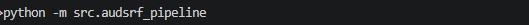


`This README provides:`

- Full pipeline overview

- Stage‑by‑stage documentation

- Architecture diagram

- Folder structure

- Installation & usage

- Snapshots (where you will upload images)

- Quality metrics


#### 🚀 `Project Overview`
The `Automated URL Discovery and Semantic Relevance Filter (AUDSRF)` pipeline is designed to:

- Accept a list of domains

- Crawl each domain deeply

- Extract internal URLs

- Filter out utility/boilerplate pages

- Extract text content

- Score each page using lexical + semantic similarity

- Produce a ranked list of relevant URLs

- Export results to CSV

- Generate quality metrics

*This pipeline is ideal for:*

- SEO research

- Market intelligence

- Topic‑focused content discovery

- Competitor analysis

- Automated dataset generation

#### 🧠 `High‑Level Architecture`

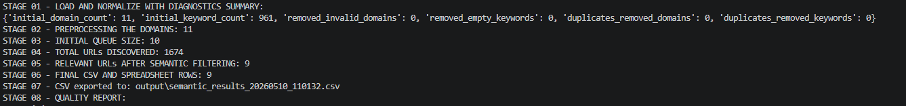


#### 🏗 `Project Folder Structure`


#### 🔢 `Stage‑by‑Stage Documentation`

The details of the full documentation for each stage is presented below:

##### 📌 `Stage 01 — Load and Normalize Data`

`File: load_and_clean_data_01.py`

- Loads input_domains.csv

- Loads target_keywords.csv

- Normalizes domains

- Cleans keyword list

- Detects malformed rows

- Produces diagnostics

###### **Code Snippet:**

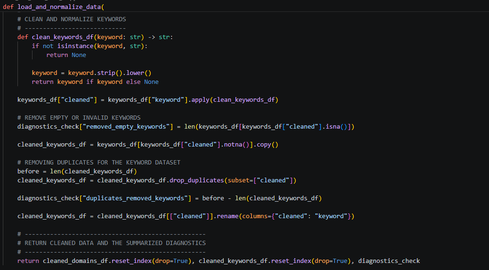


##### 📌 `Stage 02 — Domain Pre‑Processing`

`File: domain_preprocessing_02.py`

- Canonicalizes domains

- Fetches homepage

- Extracts metadata (title, H1, internal links)

- Performs health checks

- Produces crawl‑ready domain list


###### **Code Snippet:**

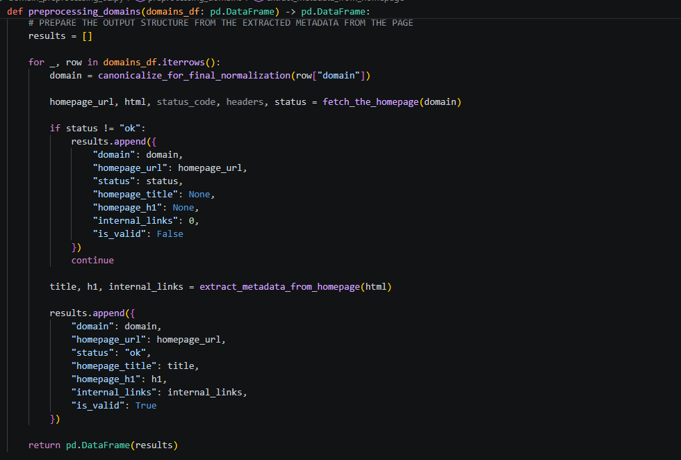


##### 📌 `Stage 04 — Crawling and Deep URL Discovery`

`File: crawling_and_deep_url_discovery_04.py`

- Fetches pages

- Extracts internal links

- Normalizes URLs

- Filters utility pages

- Expands crawl queue

- Tracks crawl depth and limits

###### **Code Snippet:**

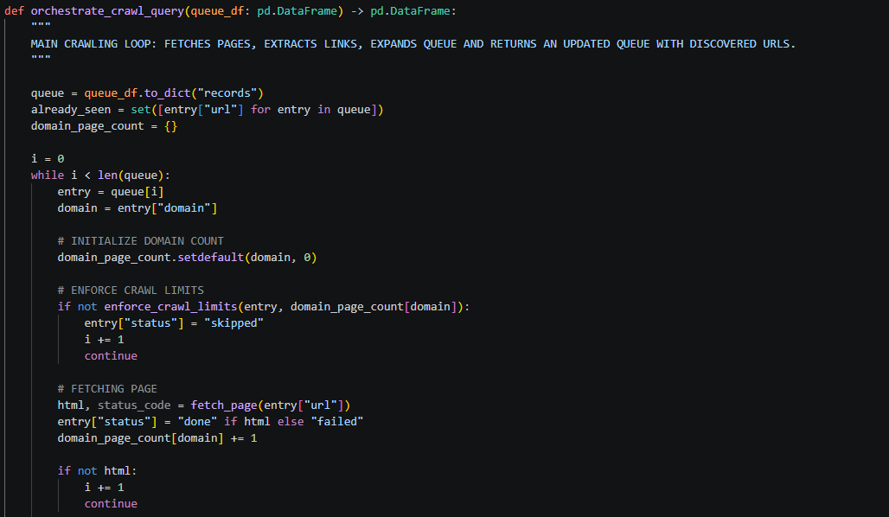


##### 📌 `Stage 05 — Semantic Relevance Filtering`

`File: semantic_relevance_filtering_05.py`

- Extracts text

- Computes lexical match

- Computes semantic similarity (TF‑IDF)

- Computes final relevance score

- Detects trigger keyword

- Filters irrelevant pages

###### **Code Snippet:**

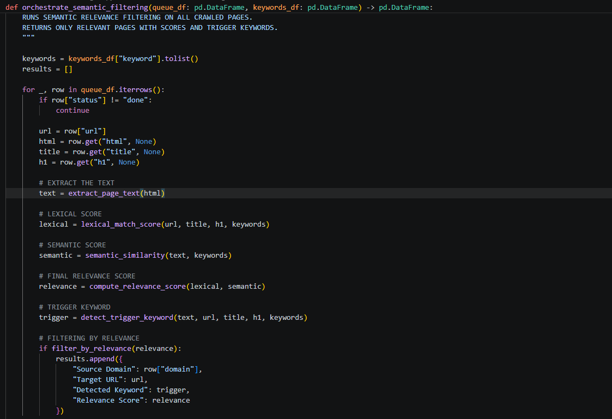


##### 📌 `Stage 06 — Output Assembly`

`File: assembling_output_06.py`

- Formats final columns

- Ranks results

- Produces spreadsheet‑ready DataFrame

###### **Code Snippet:**

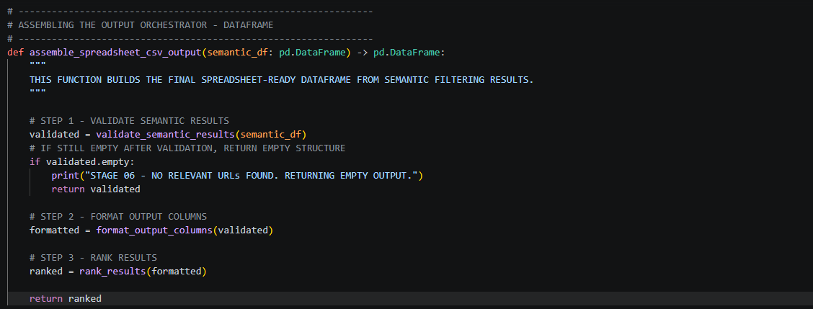


##### 📌 `Stage 07 — CSV Export`

`File: final_csv_output_generation_07.py`

- Validates DataFrame

- Creates output folder

- Generates timestamped filename

- Saves CSV

###### **Code Snippet:**

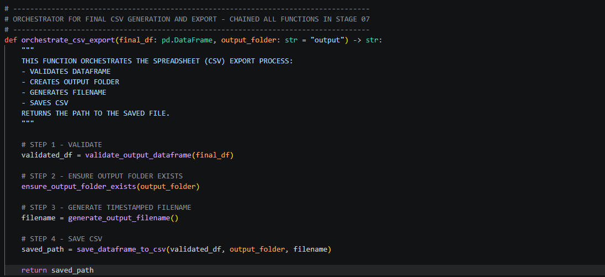


##### 📌 `Stage 08 — Quality Checks and Success Metrics`

`File: quality_checks_and_success_metrics_08.py`

- Precision score

- Granularity per domain

- Relevance distribution

- Off‑topic detection

- Crawl summary


###### **Code Snippet:**

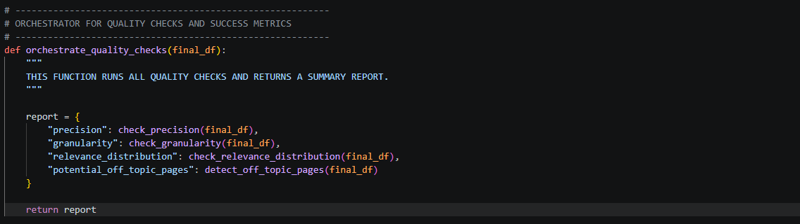


#### 🧩 `Full Pipeline Orchestrator`

*The orchestrator pipeline:*

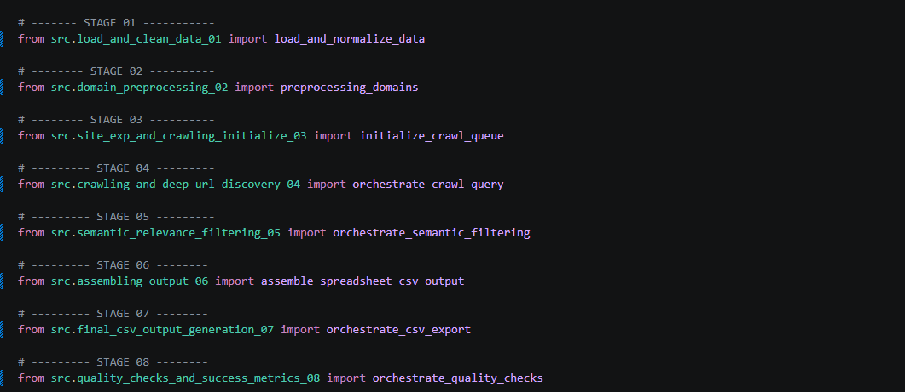


*The orchestrator script:*
```bash

run: python -m src.audsrf_pipeline
```

*The complete end-to-end running:*


#### ⚙️ `Installation`

```bash
git clone https://github.com/larrysman/automated-url-discovery-and-semantic-relevance-filter.git
cd WLDM
pip install -r requirements.txt
```


#### ▶️ `Usage`

```bash
python -m src.audsrf_pipeline
```

*Default paths and ensure you rename the input data accordingly:*

```bash
./data/input_domains.csv

./data/target_keywords.csv

Output saved to ./output/
```


#### 📊 `Final Output Structure`

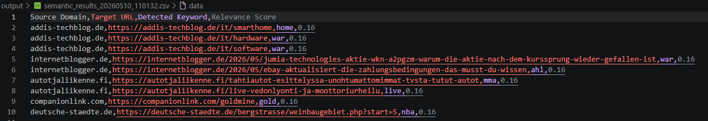


#### 🧪 `Quality Metrics`

*The pipeline generates:*

- Precision

- Granularity per domain

- Relevance score distribution

- Off‑topic URL detection

###### **Output Snippet:**

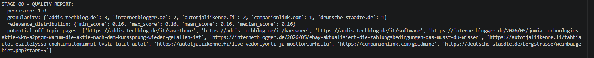


#### 🤝 `Contributing`

Pull requests are welcome and Kindly open an issue first to discuss changes.


#### 📄 `License`

**WHITE LIGHT DIGITAL MARKETING - WLDM**


#### 🎉 `Acknowledgements`

Dveloped by `Olanrewaju Adegoke`

Designed with modularity, clarity, and production-readiness in mind.

**Thank you**


